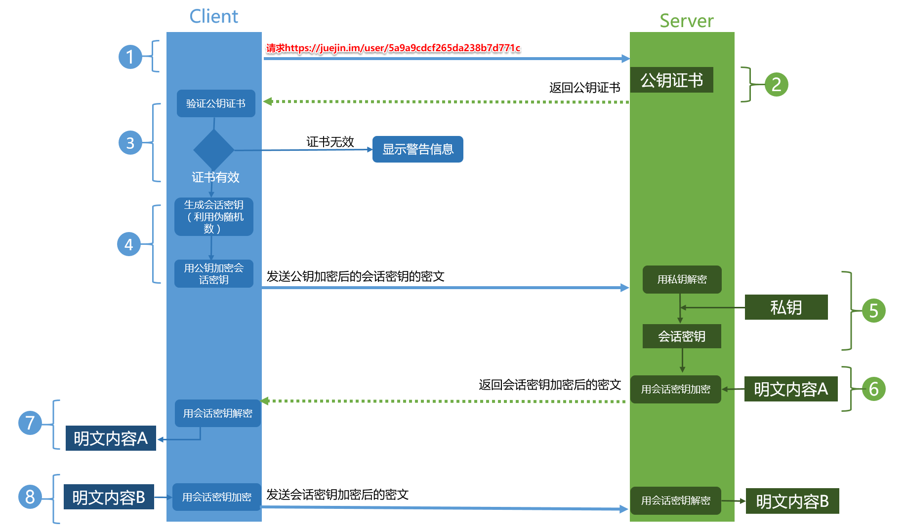
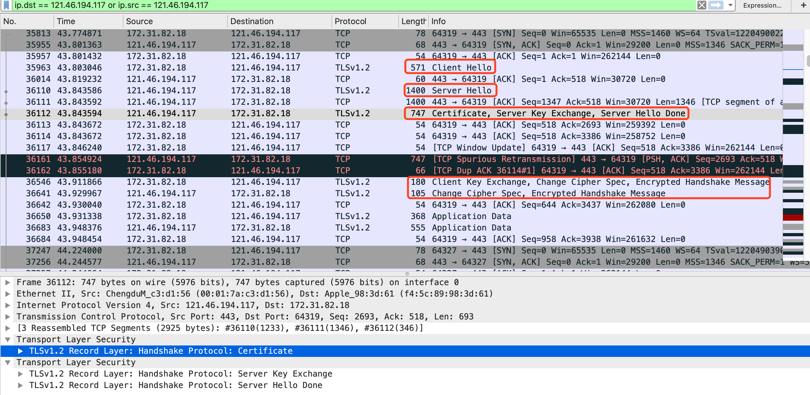

# `https` 学习笔记


## 1. `https` 的原理



1. `Client` 发起一个 `HTTPS`（比如 <https://juejin.im/user/5a9a9cdcf265da238b7d771c> ）的请求，根据 `RFC2818` 的规定，`Client` 知道需要连接 `Server` 的 `443`（默认）端口。
2. `Server` 把事先配置好的公钥证书（`public key certificate`）返回给客户端。
3. `Client` 验证公钥证书：比如是否在有效期内，证书的用途是不是匹配 `Client` 请求的站点，是不是在 `CRL`吊销列表里面，它的上一级证书是否有效，这是一个递归的过程，直到验证到根证书（操作系统内置的 `Root` 证书或者 `Client` 内置的`Root`证书）。如果验证通过则继续，不通过则显示警告信息。
4. `Client`使用伪随机数生成器生成加密所使用的对称密钥，然后用证书的公钥加密这个对称密钥，发给`Server`。
5. `Server` 使用自己的私钥（`private key`）解密这个消息，得到对称密钥。至此，`Client` 和 `Server` 双方都持有了相同的对称密钥。
6. `Server` 使用对称密钥加密“明文内容A”，发送给`Client`。
7. `Client` 使用对称密钥解密响应的密文，得到“明文内容A”。
8. `Client` 再次发起 `HTTPS` 的请求，使用对称密钥加密请求的“明文内容B”，然后 `Server` 使用对称密钥解密密文，得到“明文内容B”。


## 2. `tls1.2` 的通信流程

以访问 <www.sina.com.cn> 为例，抓包解析TLS1.2到底是如何通信的；

### 2.1 `wireshark` 抓包内容及简单说明：

```
10	0.042384	192.168.10.97	101.71.100.123	TLSv1.2	264	Client Hello
12	0.059895	101.71.100.123	192.168.10.97	TLSv1.2	1506	Server Hello
16	0.060412	101.71.100.123	192.168.10.97	TLSv1.2	1386	Certificate, Server Key Exchange, Server Hello Done
18	0.063282	192.168.10.97	101.71.100.123	TLSv1.2	180	Client Key Exchange, Change Cipher Spec, Encrypted Handshake Message
19	0.073250	101.71.100.123	192.168.10.97	TLSv1.2	312	New Session Ticket, Change Cipher Spec, Encrypted Handshake Message
20	0.073250	101.71.100.123	192.168.10.97	TLSv1.2	123	Application Data
```

`Client Hello`：客户端向服务端打招呼；携带各种信息供服务端选择；

`Server Hello`：服务端回应客户客户端的招呼信息；结合客户端、服务端的信息，选择合适的加密套件；

`Certificate`：服务端向客户端发送自己的数字证书（此证书包含服务端的公钥），以实现客户端验证身份；

`Server Key Exchange`：服务端向客户端发送基于选择的加密套件生成的公钥（此公钥是经过私钥签名认证的）；

`Server Hello Done`：服务端向客户端表示响应结束；

`Client Key Exchange`：客户端向服务端发送经过公钥加密的Pre-Master；

`Change Cipher Spec`：告知服务端/客户端，以后的通信都是加密的；

`Encrypted Handshake Message`：基于协商生成的密钥，加密握手信息让服务端/客户端进行认证；双方认证无误开始通信；

`New Session Ticket`：是优先SSL连接的一种方法，此种不做特别说明

### 2.2 身份验证过程：

- 权威ca会用自己的私钥加密服务器的公钥；

- 当客户端访问服务器的时候，服务端会向客户端发送自己的证书，由内置在浏览器的ca公钥进行解密，得到服务端的公钥；

- 由此验证公钥，私钥，从而达到验证身份的目的；




### 2.3 客户端 `Client Hello` 阶段：

作用：客户端向服务端发送建立连接请求；

此时，客户端会携带支持的版本号、支持的加密套件、客户端随机数(用于协商对称加密的密钥)、支持的HTTP协议

 

### 2.4 服务端 `Server Hello` 阶段：

作用：根据客户端所携带的内容，确定建立连接版本、加密套件，生成服务端随机数(用于协商对称加密的密钥)

确定的加密套件是：`TLS_ECDHE_RSA_WITH_AES_128_GCM_SHA256`

 

### 2.5 服务端 `Certificate, Server Key Exchange, Server Hello Done` 阶段：

`Certificate`：向客户端发送由权威 `CA` 签发的证书，以验证身份；

`Server Key Exchange`：基于 `Server Hello` 阶段选择的 `ECDHE` 交换密钥算法，发送它生成的椭圆曲线的公钥(经过签名的)

`Server Hello Done`：服务端结束打招呼阶段

**协商对称加密密钥的过程说明：**

`ECDHE`算法会根据客户端的随机数、服务端的随机数、`Pre-Master`(也是一个随机数)生成对称加密的密钥；

`Pre-Master`(此随机数非常重要)由`ECDHE`根据`Client Random、Server Random`生成；

到此，客户端/服务端都知道了客户端的随机数、服务端的随机数、`Pre-Master`；

由此客户端/服务端生成的对称加密密钥是一致的，但还是会发送一条由此密钥加密的消息让对方进行验证；


### 2.6 客户端 `Client Key Exchange`, `Change Cipher Spec`, `Encrypted Handshake Message`阶段：

`Client Key Exchange`：基于协商选择的`ECDHE`交换密钥算法，发送它生成的椭圆曲线的公钥；

`Change Cipher Spec`：变更密码规范协议，它非常简单，就是一条通知消息，告知对方以后的通信都是加密的；

`Enctypted Handshare Message`：生成对称加密密钥之后，发送一条加密的数据，让服务端解密验证；


### 2.7 服务端 `New Session Ticket, Change Cipher Spec, Encrypted Handshake Message` 阶段：

`New Session Ticket`：TLS建立连接的优化方法，此处不说；

`Change Cipher Spec`：告诉客户端以后的通信是加密的；

`Enctypted Handshare Message`：发送一条经过密钥加密的数据，让客户端验证；验证通过则开始进行加密通信；

### 2.8 `Applicatiion Data`：表示客户端/服务端已经开始基于 `TLS` 进行通信了；


## 3. `tls1.1` `tls1.2` `tls1.3` 的区别

[ SSL3 TLS1.0 TSL1.1 TLS1.2 TLS 1.3协议版本间的差异](https://www.anxinssl.com/9464.html)

[TLS1.3 VS TLS1.2，让你明白TLS1.3的强大](https://zhuanlan.zhihu.com/p/44980381)


## 相关介绍

```
1.`CA`证书是企业将自己的 公钥 交给专业机构，并且被 CA私钥加密后的证书，一般交于客户端。
2. CA证书中一般都包含 企业的公钥、域名，以及该证书内容域采用的Hash算法
3. CA证书：证书内容 -> Hash摘要 -> CA私钥加密 -> 生成CA证书
4. 客户端/浏览器： 拿证书签名域 -> CA公钥 ->  摘要值
4. 客户端/浏览器： 拿证书内容域 -> 使用CA内容域的Hash -> 生成摘要 【对比这两个摘要 -> 保证 公钥 没有被篡改】
```


## 参考文献

1. [数字签名是什么？](http://www.ruanyifeng.com/blog/2011/08/what_is_a_digital_signature.html)
2. [抓包解析TLS1.2的通讯过程](https://www.cnblogs.com/abelchao/p/11804061.html)